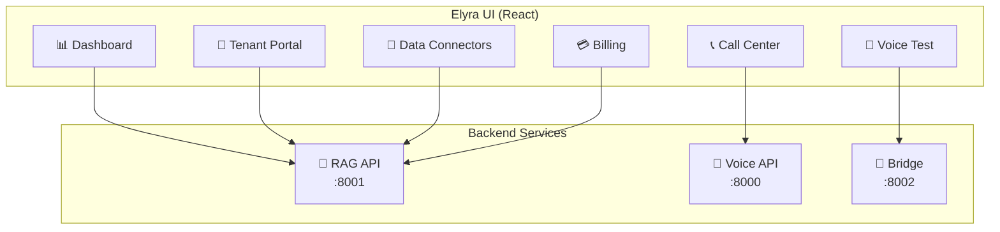
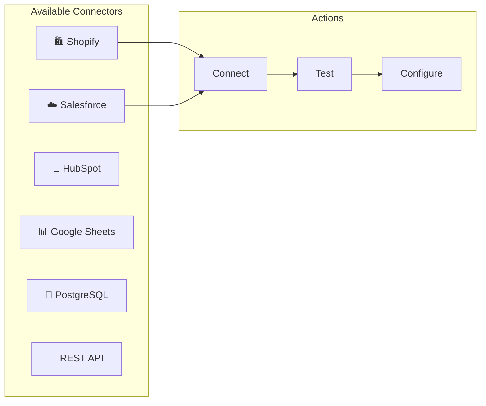

# Elyra UI - Voice AI Platform Dashboard

Modern React dashboard for the Elyra Voice AI Platform. Self-service portal for tenants to manage their voice AI, data connectors, billing, and analytics.

## 🎯 Key Features

- **Tenant Self-Service Portal** - Onboard without engineering
- **Data Connectors UI** - Connect Shopify, Salesforce, etc.
- **Billing Dashboard** - Usage monitoring, plans, invoices
- **Call Center Console** - Live call monitoring
- **Voice Testing** - Test AI directly in browser
- **Real-time Analytics** - Usage and performance metrics

## 🏗️ Architecture



## 🚀 Quick Start

```bash
# Clone
git clone https://github.com/Dhanpat07/elyra-ui.git
cd elyra-ui

# Install dependencies
npm install

# Start development server
npm run dev

# Build for production
npm run build
```

## 📱 Pages

### Dashboard
Real-time overview of platform health and metrics.

### Tenant Portal (`/portal`)
Self-service onboarding:
- Upload data files (Excel, CSV, PDF)
- Configure AI persona
- Set up voice and language
- Deploy in minutes

### Data Connectors (`/connectors`)


### Billing (`/billing`)
- View current plan and usage
- Upgrade/downgrade subscription
- Download invoices
- Set up payment methods
- Configure usage alerts

### Call Center (`/callcenter`)
Live call monitoring dashboard:
- Active calls count
- Call queue status
- Agent availability
- Real-time metrics

### Voice Test (`/voice`)
Test your AI directly in the browser:
- Real-time transcription
- AI responses
- Latency metrics

## 🏛️ Project Structure

```
elyra-ui/
├── src/
│   ├── pages/
│   │   ├── DashboardPage.tsx
│   │   ├── TenantPortalPage.tsx
│   │   ├── DataConnectorsPage.tsx
│   │   ├── BillingPage.tsx
│   │   ├── CallCenterPage.tsx
│   │   ├── VoicePage.tsx
│   │   ├── RAGPage.tsx
│   │   └── SettingsPage.tsx
│   ├── components/
│   │   ├── Sidebar.tsx
│   │   ├── UserMenu.tsx
│   │   └── ...
│   ├── hooks/
│   │   └── useAuth.ts
│   ├── api.ts
│   ├── store.ts
│   └── App.tsx
├── package.json
└── vite.config.ts
```

## 🎨 UI Components

### Billing Plans Card
```tsx
// Displays pricing tiers with features
<PlanCard
  name="Growth"
  price={199}
  features={[
    "1M requests/month",
    "10M LLM tokens",
    "20 concurrent calls"
  ]}
  recommended={true}
/>
```

### Connector Card
```tsx
// Shows connector status and tools
<ConnectorCard
  name="Shopify"
  status="connected"
  tools={["get_orders", "get_products"]}
  onTest={() => testConnection()}
/>
```

### Usage Meter
```tsx
// Real-time usage visualization
<UsageMeter
  used={45000}
  limit={100000}
  label="API Requests"
/>
```

## 🔧 Configuration

```typescript
// src/config.ts
export const API_BASE = 'http://localhost:8001';
export const VOICE_WS = 'ws://localhost:8000/ws/voice';
export const BRIDGE_WS = 'ws://localhost:8002/bridge';
```

## 📊 State Management

Using Zustand for global state:

```typescript
// src/store.ts
interface Store {
  activePage: string;
  setActivePage: (page: string) => void;
  health: Record<string, 'up' | 'down' | 'checking'>;
}
```

## 🔐 Authentication

Supabase authentication with tenant isolation:

```typescript
// src/hooks/useAuth.ts
const { user, profile, signIn, signOut } = useAuth();

// Profile includes tenant_id for data isolation
profile.tenant_id // e.g., "zomato"
```

## 🌙 Dark Theme

Built with Tailwind CSS dark theme:

```css
/* Dark surface colors */
--surface-900: #0f0f1a;
--surface-800: #13131f;
--surface-700: #1a1a2e;

/* Brand colors */
--brand-500: #6366f1;
--brand-400: #818cf8;
```

## 📦 Dependencies

- **React 18** - UI framework
- **Vite** - Build tool
- **Tailwind CSS** - Styling
- **Framer Motion** - Animations
- **Zustand** - State management
- **Lucide React** - Icons
- **Sonner** - Toast notifications

## 🖼️ Screenshots

### Dashboard
Real-time metrics and health status.

### Data Connectors
Connect external data sources with one click.

### Billing
Usage monitoring and subscription management.

## 📚 Related Repositories

- [elyra-rag](https://github.com/Dhanpat07/elyra-rag) - RAG engine
- [laali-elyra-duplex-ultrafast](https://github.com/Dhanpat07/laali-elyra-duplex-ultrafast) - Voice agent
- [voice-rag-bridge](https://github.com/Dhanpat07/voice-rag-bridge) - WebSocket bridge

## 📄 License

MIT
